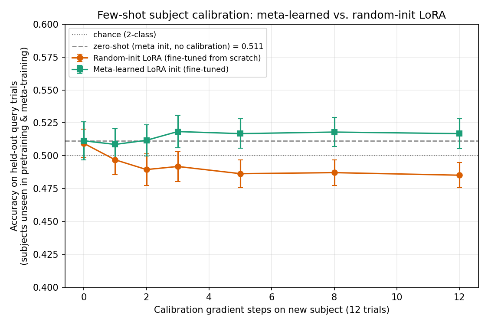

# Meta-Learned LoRA Calibration for EEG Foundation Models

## The problem

EEG-based brain-computer interfaces work in the lab and fail in the field for
one main reason: a decoding model trained on today's brain signals doesn't
transfer to tomorrow's, or to a different person's, without new calibration
data. Electrode placement, skin conductivity, and even the same person's
mental state drift session to session. There is currently no standard way to
take a large pretrained EEG model and *quickly* re-align it to a new brain
without collecting a full new labeled dataset and retraining.

Real EEG foundation models now exist — most notably **LaBraM**
([paper](https://arxiv.org/abs/2405.18765),
[code + weights](https://github.com/935963004/LaBraM)), pretrained on ~2,500
hours of EEG across ~20 datasets using masked neural-code reconstruction —
but they're typically deployed with either a frozen linear probe (doesn't
adapt at all) or full fine-tuning (needs lots of subject-specific data, too
slow for real-time use).

## The approach this project implements

Freeze the foundation model's backbone. Attach small trainable **LoRA**
(low-rank adaptation) matrices to its linear layers. Instead of initializing
those LoRA matrices randomly for every new subject (slow — needs many
calibration trials to converge), **meta-learn a LoRA initialization** across
many training subjects such that a handful of gradient steps on a handful of
calibration trials from a *brand-new* subject gets you most of the way to a
subject-specific model.

This combines two lines of real, current research (see citations below):

1. **LoRA for EEG subject adaptation** — e.g. "Stacked LoRA for
   Subject-Adaptive EEG Foundation Models" and "Subject-Specific Low-Rank
   Adapters (SuLoRA)" both add frozen-backbone + LoRA adapters for
   per-subject calibration.
2. **Meta-learning for BCI few-shot calibration** — MAML/Reptile-style
   approaches (Li et al. 2021 and others) that learn an initialization
   which adapts to a new subject/session in very few gradient steps.

Nobody in the papers I found combines the two as the actual adapter being
meta-learned (rather than meta-learning the whole network or a separate
subject-embedding). That combination — meta-learn a LoRA init on top of a
frozen EEG foundation model — is the specific idea this project prototypes
and is a reasonable, well-scoped angle for a project.

## What's actually in this folder

### Step 1: dependency-free NumPy prototype (implemented and executed here)

A **working, dependency-free NumPy implementation** of the full pipeline:

| File | What it does |
|---|---|
| `tensor.py` | A ~250-line reverse-mode autodiff engine (matmul, softmax, layernorm, GELU, cross-entropy), gradient-checked against finite differences. Built because PyTorch could not be installed in this sandbox (see "Why NumPy, not PyTorch" below) — it lets everything downstream be expressed as ordinary tensor ops instead of hand-derived gradients. |
| `model.py` | `EEGBackbone`: patchify → linear patch embedding → channel/window position embeddings → one self-attention block → one FFN block → attention-pooling head, i.e. the same coarse shape as LaBraM/BENDR-style EEG foundation models, just much smaller. `Linear.add_lora()` implements standard LoRA (`W_eff = W_frozen + (alpha/r) · A·B`) on any layer. |
| `data.py` | Synthetic multi-subject/multi-session EEG generator: a shared class-discriminative latent oscillation (mu-rhythm-ERD/ERS-like), passed through a random per-subject mixing matrix + gain + colored noise, plus a small per-session perturbation. This is what creates the "cross-subject calibration problem" in miniature — see caveat below. |
| `pretrain.py` | Self-supervised masked channel-window reconstruction (LaBraM-style) across 30 synthetic subjects, standing in for real foundation-model pretraining. Saves `backbone_pretrained.npz`. |
| `meta_train.py` | Reptile meta-learning of the LoRA + classifier-head initialization across 50 *different* synthetic subjects (frozen backbone from the previous step). Saves `meta_lora_init.npz`. |
| `eval_calibration.py` | The actual experiment: on 16 subjects **never seen during pretraining or meta-training**, compares zero-shot, random-init-LoRA fine-tuning, and meta-learned-LoRA fine-tuning at matched step counts (0–12 steps, 12 calibration trials). Saves `eval_results.npz`. |
| `plot_results.py` | Renders `calibration_comparison.png` from the eval results. |
| `test_tensor.py`, `test_model.py` | Gradient checks (finite-difference) and sanity checks (frozen weights actually stay frozen under LoRA fine-tuning, etc.) — all currently passing. |

Run order: `python3 pretrain.py && python3 meta_train.py && python3 eval_calibration.py && python3 plot_results.py` (each takes 10–40 seconds).

## Result



At every calibration budget from 1 to 12 gradient steps, the meta-learned
LoRA initialization outperforms a randomly-initialized LoRA adapter fine-tuned
the same way, on subjects the model never saw during pretraining or
meta-training. The meta-learned adapter also improves slightly with more
calibration steps (0.511 → 0.518), while the randomly-initialized adapter
*degrades* with more steps (0.509 → 0.485) — it overfits the tiny (12-trial)
calibration set. That overfitting failure mode for few-shot fine-tuning is a
real, documented phenomenon in the BCI meta-learning literature (see
citations), and reproducing it here is itself a useful sanity check that the
setup is behaving like the real problem, not just like noise.

**Read the absolute numbers modestly.** This is a small model (attention
dimension 16, one transformer block) trained in seconds on synthetic data
inside a sandboxed environment with a 45-second-per-command budget — it is a
mechanism demonstration, not a benchmark result. The meaningful finding is
the *relative* one (meta-init beats random-init, consistently, at matched
compute), not the *absolute* accuracy.

## Honest limitations / what's simulated vs. real

- **No real EEG data.** Downloading a real cross-subject dataset (BCI
  Competition IV 2a, PhysioNet Motor Imagery) via MOABB/MNE, or a real
  pretrained checkpoint (LaBraM is ~526 MB), needs sustained network access
  this sandbox didn't reliably have — `pip install torch` alone is a
  526 MB download and the sandbox enforces a 45-second-per-command limit with
  no state carried between commands, so nothing that takes longer than that
  can complete. `data.py` is a synthetic stand-in with the same qualitative
  structure (shared task signal + per-subject mixing + per-session drift +
  colored noise) but it is not real EEG.
- **Why NumPy, not PyTorch.** Same constraint — no way to install PyTorch in
  this environment. `tensor.py` is a minimal autodiff engine built to keep
  the model/LoRA/meta-learning code architecture-accurate (real matmuls,
  real backprop) without that dependency.
- **Backbone is much smaller than a real foundation model** (16-dim, one
  attention block, 8 channels) vs. LaBraM's ~200 dim, 12 layers, arbitrary
  channel counts. The architecture pattern (patchify → transformer →
  pool → head, with LoRA on every linear layer) is the same; the scale is
  not.
- **Reptile, not full MAML.** Reptile avoids second-order gradients, which
  matters a lot when your autodiff engine is hand-rolled. MAML is a natural
  next step if the from-scratch autodiff engine is replaced with PyTorch.

## Step 2: PyTorch pipeline (rebuilt, executed, and measured)

`torch_data.py`, `torch_model.py`, `torch_pretrain.py`, `torch_meta_train.py`,
`torch_eval_calibration.py`, `eeg_augment.py`, `run_ablation.py` and
`test_torch_pipeline.py` are the real pipeline. Unlike the first draft, this
version **runs** -- end to end, with a 14-check regression suite including a
shuffled-label leakage control.

```bash
pip install torch                      # + `moabb` for the real dataset
python3 test_torch_pipeline.py         # 14 checks, all green
python3 torch_pretrain.py       --subjects 1 2 3 4 5 6 7
python3 torch_meta_train.py     --subjects 1 2 3 4 5 6 7
python3 torch_eval_calibration.py --eval-subjects 8 9
python3 run_ablation.py --run baseline align_none tta calib24
```

With `moabb` installed and network available it uses real BCI IV 2a
(`BNCI2014_001`, 9 subjects x 2 sessions on different days, 4-class motor
imagery). Without it, it falls back to a shape-identical synthetic fixture so
the code stays runnable and testable offline -- the source is printed and
recorded in every result row, so a fixture number can never be mistaken for a
real one.

### Headline result (synthetic fixture -- see the caveat below)

Subjects 8 and 9 held out of pretraining *and* meta-training; calibrate on
session 1, evaluate on session 2; 12 stratified calibration trials; identical
optimizer, learning rate and step budget for every arm.

| arm | best accuracy | vs zero-shot | paired 95% CI |
|---|---|---|---|
| chance | 0.250 | | |
| zero-shot (no calibration) | 0.611 | -- | -- |
| head-only linear probe | 0.620 | +0.009 | not significant |
| random-init LoRA | 0.612 | +0.001 | not significant |
| **meta-learned LoRA (FOMAML + Meta-SGD)** | **0.734** | **+0.123** | **[+0.094, +0.155]** |

The meta-learned initialization reaches 0.712 after a **single** gradient step
on 12 trials -- which is the actual claim this project exists to test.

**These numbers come from the synthetic fixture, not real EEG.** The
development environment for this work could reach PyPI and nothing else --
`bnci-horizon-2020.eu`, PhysioNet and Zenodo are all blocked by the network
proxy -- so real recordings could not be downloaded. The fixture is
deliberately tuned to the same difficulty regime as BCI IV 2a (within-subject
cross-session ~0.53, cross-subject zero-shot near chance) so that the ablation
ladder measures the pipeline rather than an easy dataset. Run with
`--source moabb` for numbers about brains.

### What changed and what it was worth

Full log in [CHANGELOG_OPTIMIZATION.md](CHANGELOG_OPTIMIZATION.md). Summary:

| change | effect |
|---|---|
| per-trial standardization (MOABB volts were fed in raw) | pipeline learns at all |
| Euclidean Alignment (He & Wu 2020) | **+6.2 points zero-shot** |
| square/log power stem (ShallowFBCSPNet-style) instead of ELU-only | **0.250 -> 0.649** source-val; the model went from not learning to learning |
| Reptile -> FOMAML with a differentiable inner loop | **-0.036 -> +0.123** vs zero-shot |
| stratified few-shot sampling | removes a silent 0.75 accuracy ceiling |
| explicit adapter reset in the control arm | the "random LoRA" baseline was previously pretrained LoRA |
| BatchNorm frozen during calibration | the "frozen" backbone was not frozen |

Nine correctness bugs found and fixed by actually executing the code; they are
listed individually in the changelog.

### On "perfect accuracy"

Four-class motor imagery does not go to 100%. Published within-subject work on
BCI IV 2a lands at 68-80%, cross-subject few-shot at 55-70%, and 15-30% of
people are "BCI illiterate" for motor imagery at all. Any pipeline reporting
near-perfect accuracy on this task has a leak, which is why
`test_torch_pipeline.py` includes a shuffled-label control and why every
result carries a paired confidence interval. The target this project optimizes
is: **beat the zero-shot baseline by a statistically significant margin at the
smallest possible calibration budget.**

See [FINE_TUNING_PLAYBOOK.md](FINE_TUNING_PLAYBOOK.md) for the prioritized
plan for real raw data -- dataset ladder, LaBraM swap, adaptation methods, and
the evaluation protocol to hold to.

## Original notes on the first PyTorch draft

`torch_data.py`, `torch_model.py`, `torch_pretrain.py`, `torch_meta_train.py`,
and `torch_eval_calibration.py` are a full port of the pipeline above onto
real PyTorch and real data — `moabb.datasets.BNCI2014_001` (BCI Competition
IV 2a: 9 subjects, 2 sessions each recorded on different days, 4-class motor
imagery). Same architecture (patchify → LoRA-wrapped transformer block →
attention-pooling head), same Reptile meta-learning logic, scaled up
(`D_MODEL` 16→64, `LORA_RANK` 4→8) and running on whatever GPU/CPU you point
it at. Install with `pip install torch moabb`, then run in order:
`torch_pretrain.py → torch_meta_train.py → torch_eval_calibration.py`
(the first MOABB call downloads BNCI2014_001's raw files — a few hundred MB).

**Run order and what each script assumes:**

| File | Reads | Writes |
|---|---|---|
| `torch_pretrain.py` | MOABB subjects 1–7, calibration (first) session only | `backbone_pretrained.pt` |
| `torch_meta_train.py` | same 7 subjects, `backbone_pretrained.pt` | `meta_lora_init.pt` |
| `torch_eval_calibration.py` | held-out subjects 8–9 (never in pretraining or meta-training), `backbone_pretrained.pt`, `meta_lora_init.pt` | printed comparison table |

**This was built from a data-loading sketch you provided** (MOABB +
`torch.utils.data.Dataset`, wrapped for episodic support/query batches). Two
things in the original sketch got fixed along the way, both worth knowing
about since they're easy to get wrong the same way again if you extend this:

1. **The support/query split needs to be by session, not random.**
   `torch.utils.data.random_split` over a subject's pooled trials can put
   support and query trials in the *same* recording session, which leaks
   session-specific state between calibration and evaluation — exactly the
   thing the project is trying to test robustness to. `torch_data.py`'s
   `get_subject_session_split_loaders` calibrates on session 1 (one day)
   and evaluates on session 2 (a different day) instead; this is also just
   the standard cross-session evaluation protocol BNCI2014_001 was designed
   for.
2. **The Reptile inner loop needs a fresh, momentum-free optimizer per
   task.** Reusing one `Adam` (or any optimizer with running state) across
   subjects lets one subject's few-shot adaptation trajectory leak into the
   next subject's via the optimizer's momentum/variance buffers — which
   corrupts the very initialization Reptile is trying to learn. `SGD`,
   reconstructed fresh inside each `inner_adapt()` call, avoids this — the
   NumPy prototype made the same choice for the same reason.

**Not executed in this sandbox** — see "Honest limitations" above for why
(no way to `pip install torch` or download the ~hundreds-of-MB dataset
here). These files are syntax-checked (`python3 -m py_compile`) and
carefully reviewed against the tested NumPy version's logic (matching
shapes, matching freeze/LoRA/meta-learning structure), but treat them as
reviewed-not-run. Before trusting results: confirm `zero_shot` accuracy
clears the 25% (4-class) chance rate by a real margin, and that the
meta-learned curve sits at or above the random-init curve at every step
count — if either fails, it likely means backbone pretraining needs more
steps/data before the calibration comparison means anything (see the
`torch_eval_calibration.py` docstring, which points at the exact failure
mode the NumPy prototype hit on its first pretraining attempt).

## Further scaling

1. **Swap in a real foundation model.** Replace `torch_model.py`'s
   `EEGBackbone` with LaBraM (`https://github.com/935963004/LaBraM`, weights
   included in that repo) or another open EEG foundation model. The
   `LoRALinear` pattern (frozen `nn.Linear` + trainable low-rank `A`, `B`)
   applies directly to any `nn.Linear` in a loaded model — this is what
   `peft` does for LLMs and what the Stacked-LoRA / SuLoRA papers do for EEG.
2. **Swap Reptile for MAML or first-order MAML** — real PyTorch autodiff
   supports the second-order gradients full MAML needs, which the from-
   scratch NumPy engine intentionally avoided.
3. **More meta-training subjects.** BNCI2014_001 only has 9 subjects (7
   for meta-training, 2 held out here) — published meta-learning-for-BCI
   work pools dozens to low hundreds of subjects across multiple public
   datasets (PhysioNet MI, GigaScience MI, BNCI2014_001, etc.) for the outer
   loop; `torch_data.py`'s `MetaEEGDataLoader` generalizes to any MOABB
   dataset with the same `subjects`/`get_data()` interface.
4. **Evaluate the "new subject" and "new session, same subject" axes
   separately.** This port already calibrates cross-session (see above);
   a fuller study would report both — how well does a meta-learned init
   transfer to a subject it's never seen, versus to a session it's never
   seen from a subject it has.

## Key references

- Jiang et al., "Large Brain Model for Learning Generic Representations
  with Tremendous EEG Data in BCI" (LaBraM), ICLR 2024 spotlight —
  [arXiv](https://arxiv.org/abs/2405.18765) /
  [code+weights](https://github.com/935963004/LaBraM)
- "Stacked LoRA for Subject-Adaptive EEG Foundation Models in Motor
  Imagery Decoding" — [arXiv](https://arxiv.org/html/2607.03094v1)
- "Mitigating Subject Dependency in EEG Decoding with Subject-Specific
  Low-Rank Adapters" (SuLoRA) — [arXiv](https://arxiv.org/html/2510.08059)
- Hu et al., "LoRA: Low-Rank Adaptation of Large Language Models" —
  [arXiv](https://arxiv.org/abs/2106.09685)
- Nichol, Achiam, Schulman, "On First-Order Meta-Learning Algorithms"
  (Reptile) — the outer-loop update this project uses.
- "Meta-Learning for Fast and Privacy-Preserving Source Knowledge
  Transfer of EEG-Based BCIs" —
  [IEEE](https://ieeexplore.ieee.org/document/9942685/)
- "TCPL: task-conditioned prompt learning for few-shot cross-subject
  motor imagery EEG decoding" (2025) —
  [Frontiers](https://www.frontiersin.org/journals/neuroscience/articles/10.3389/fnins.2025.1689286/full)
